### ΤΕΧΝΟΛΟΓΙΕΣ ΕΦΑΡΜΟΓΩΝ ΔΙΑΔΙΚΤΥΟΥ ΕΡΓΑΣΙΑ ΕΑΡΙΝΟΥ ΕΞΑΜΗΝΟΥ 2021

### Εφαρμογή Επαγγελματικής Δικτύωσης (τύπου LinkedIn)

<hr/>

### Team 
- [gianniskp](https://github.com/giannhskp)
- [sitaras](https://github.com/Sitaras)


### Γενικά Σχόλια
```sh
- Για το back-end χρησιμοποιήσαμε Spring Boot.
- Για το front-end χρησιμοποιήσαμε Angular 5.
- Για την βάση δεδομένων χρησιμοποιήσαμε MySQL.
- Όλες οι αιτήσεις γίνονται χρησιμοποιώντας το πρωτόκολλο SSL/TLS. Στον φάκελο resources του back-end υπάρχει και το αντίστοιχο self-signed certificate (Java KeyStore file).
- Ο server (back-end) δέχεται αιτήσεις στο port 8443 (λόγω του ssl).
- Για να “τρέξει” το front-end εκτελούμε την εντολή: **ng serve --ssl true** έτσι ώστε να μπορούμε να χρησιμοποιήσουμε το πρωτόκολλο ssl/tls. Συνδεόμαστε στην εφαρμογή μέσω του browser στην διεύθυνση: **[https://localhost:4200**](https://localhost:4200)**

Πριν την πρώτη εκτέλεση του front-end χρειάζεται να εκτελεστεί η εντολή npm install έτσι ώστε να εγκατασταθούν όλα τα node-modules που χρησιμοποιούνται.

- **ΣΗΜΑΝΤΙΚΗ ΠΑΡΑΤΗΡΗΣΗ**: Λόγω του self-signed certificate, ενδεχομένως να χρειαστεί να πραγματοποιηθούν οι ακόλουθες δύο ενέργειες χωρίς τις οποίες ίσως να μην λειτουργεί η εφαρμογή:

- Κατά την πρόσβασή στην διεύθυνση **[https://localhost:4200**](https://localhost:4200)**, ενδεχομένως ο browser να προβάλει κάποια ειδοποίηση ασφαλείας την οποία και πρέπει να προσπεράσουμε πατώντας να συνεχίσουμε.
- Ανάλογα με τον browser που χρησιμοποιούμε ενδεχομένως να χρειαστεί να επιτρέψουμε εκ των προτέρων τα self-signed certificates. Διαφορετικά, για λόγους ασφαλείας η εφαρμογή ενδεχομένως να μην είναι λειτουργική.

Για παράδειγμα, σε Google Chrome, μπορούμε να επιτρέψουμε τα self-signed certificates πατώντας στο search bar :

chrome://flags/#allow-insecure-localhost

και ενεργοποιώντας την πρώτη επιλογή που εμφανίζεται.

- Για την διαχείριση/αποθήκευση των κωδικών πρόσβασης χρησιμοποιούμε κρυπτογράφηση μέσω του PasswordEncoder του spring security.
- Για το authentication ενός χρήστη κατα την σύνδεση του χρησιμοποιούμε τον Authentication Manager του spring security.
- Οι αιτήσεις έπειτα από την σύνδεση ενός χρήστη περιέχουν ένα JSON Web Token το οποίο ο χρήστης λαμβάνει κατα την σύνδεσή του και το οποίο ανανεώνεται κάθε φορά που λήγει. Μέσω του token ο χρήστης μπορεί να έχει πρόσβαση σε όλες τις προστατευόμενες καρτέλες της εφαρμογής στις οποίες δεν μπορεί να έχει πρόσβαση ένας μη συνδεδεμένος χρήστης.
- Ένας μη συνδεδεμένος χρήστης έχει πρόσβαση μόνο στο Welcome Page και αντίστοιχα στις καρτέλες σύνδεσης/εγγραφής. Κάθε προσπάθεια για αίτημα ενός μη συνδεδεμένου χρήστη σε οποιαδήποτε άλλη διεύθυνση απορρίπτεται.
```

### Welcome Page

Η “εικόνα” που συναντά ο χρήστης ανοίγοντας την σελίδα καλωσορίσματος είναι η εξής:


### Εγγραφή χρήστη

Η εικόνα που συναντά ο χρήστης κατα την εγγραφή του είναι η εξής:


### Σύνδεση χρήστη

Η εικόνα που συναντά ο χρήστης στην σελίδα σύνδεσης είναι η εξής:


### Αρχική Σελίδα


Η εικόνα που συναντά ακολουθεί στην συνέχεια. Κάθε ένα από τα αριθμημένα στοιχεία περιγράφεται στην συνέχεια.

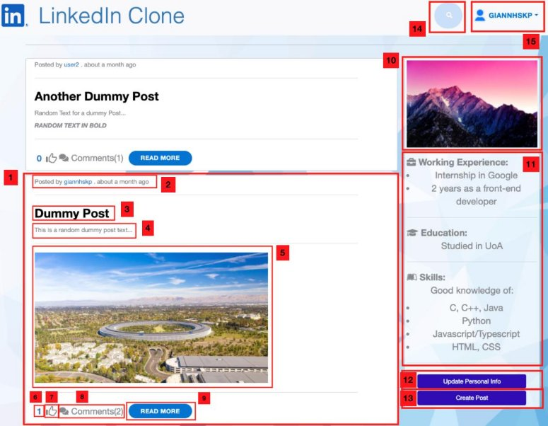

Στην αρχική σελίδα εμφανίζονται με χρονολογική σειρά άρθρα τα οποία είτε έχουν αναρτηθεί από τον ίδιο τον χρήστη, είτε από κάποιον χρήστη ο οποίος είναι συνδεδεμένος με αυτόν, είτε άρθρα στα οποία έχει δηλώσει το ενδιαφέρον του κάποιος χρήστης από το δίκτυο του τρέχοντος χρήστη.

1. Ένα άρθρο κάποιου χρήστη χρήστη.
1. Πληροφορίες για το ποιός ανέβασε το συγκεκριμένο άρθρο καθώς και για το χρονικό διάστημα το οποίο ανέβηκε. Πατώντας πάνω στο όνομα του “συγγραφέα” γίνεται ανακατεύθυνση στο προφίλ του.
1. Ο τίτλος του άρθρου.
1. Το κείμενο/περιεχόμενο του άρθρου.
1. Ένα άρθρο μπορεί να περιέχει και φωτογραφία ή βίντεο, όπως φαίνεται και από το συγκεκριμένο άρθρο το οποίο περιέχει μια φωτογραφία. Ωστόσο μπορεί να μην περιέχει και τίποτα από τα δύο όπως φαίνεται στο αμέσως επόμενο άρθρο.
1. Ο αριθμός των ατόμων που έχουν δηλώσει το ενδιαφέρον τους για το συγκεκριμένο άρθρο.
7. Μέσω αυτού του κουμπιού ο χρήστης μπορεί να δηλώσει το ενδιαφέρον του για το συγκεκριμένο άρθρο. Πατώντας το κουμπί, αλλάζει σε πράσινο χρώμα δείχνοντας ότι έχει δηλωθεί ενδιαφέρον για αυτό το άρθρο, και προφανώς αυξάνεται ο αριθμός των ατόμων που έχουν δηλώσει ενδιαφέρον για το άρθρο. Αν ξανά πατηθεί το κουμπί τότε επιστρέφει στο αρχικό του χρώμα και αφαιρείται η δήλωση του ενδιαφέροντος, μειώνοντας έτσι τον αριθμό δηλώσεων ενδιαφέροντος του άρθρου κατά ένα.


8. Πατώντας αυτό το κουμπί ο χρήστης μπορεί να δει τα ήδη υπάρχοντα σχόλια του άρθρου καθώς και να προσθέσει δικά του σχόλια.
8. Πατώντας αυτό το κουμπί ο χρήστης ανακατευθύνεται σε νέα σελίδα η οποία περιέχει μόνο το συγκεκριμένο άρθρο και τα σχόλια του. Μέσω αυτής της σελίδας μπορεί και να σχολιάσει το άρθρο.
8. Η φωτογραφία προφίλ του χρήστη.
8. Τα προσωπικά στοιχεία του χρήστη, όπως : επαγγελματική εμπειρία, εκπαίδευση και δεξιότητες. Τα στοιχεία αυτά μπορούν να ενημερωθούν είτε μέσω του κουμπιού [12] είτε μέσω της καρτέλας “Προσωπικά Στοιχεία” (εξηγείται στην συνέχεια).
8. Πατώντας αυτό το κουμπί ο χρήστης ανακατευθύνεται στην καρτέλα “Προσωπικά Στοιχεία”. Περαιτέρω λεπτομέρειες εξηγούνται στην συνέχεια.
8. Πατώντας αυτό το κουμπί ο χρήστης ανακατευθύνεται σε μια νέα καρτέλα μέσω της οποίας μπορεί να ανεβάσει ένα νέο άρθρο. Για την συγγραφή ενός νέου άρθρου ο χρήστης πρέπει να εισάγει τον τίτλο του άρθρου το κείμενο/περιεχόμενο του και προεραιτικά κάποια φωτογραφία ή βίντεο.
8. Πλαίσιο εισόδου για αναζήτηση επαγγελματιών που έχουν εγγραφεί στην εφαρμογή. Η αναζήτηση γίνεται με βάση το όνομα χρήστη και εμφανίζονται όλοι οι χρήστες των οποίο το όνομα περιέχει την λέξη η οποία δόθηκε για αναζήτηση. Τα αποτελέσματα εμφανίζονται σε μορφή λίστας και πατώντας στο όνομα ενός χρήστη γίνεται ανακατεύθυνση στο προφίλ του.
8. Αρχικά φαίνεται το όνομα του χρήστη. Πατώντας πάνω, εμφανίζεται ένα drop down menu μέσω του οποίου η χρήστης μπορεί να πλοηγηθεί στις αντίστοιχες καρτέλες.


Το menu έχει την εξής μορφή:


### Προβολή Προφίλ

Προβολή Προσωπικού Προφίλ


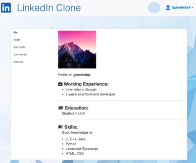

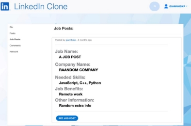

### Προβολή Προφίλ Άλλων Χρηστών


Η εικόνα που συναντά ένας χρήστης προβάλλοντας το προφίλ ενός άλλου χρήστη είναι η εξής:


### Σύνδεση Μεταξύ Χρηστών

Οι χρήστες giannhskp και user23 δεν είναι συνδεδεμένοι (ο giannhskp βλέπει το προφίλ του user23):


O giannhskp στέλνει αίτημα σύνδεσης στον user23.

Ο giannhskp βλέπει το προφίλ του user23:


Ο user23 βλέπει το προφίλ του giannhskp (τα στοιχεία του giannhskp είναι public):

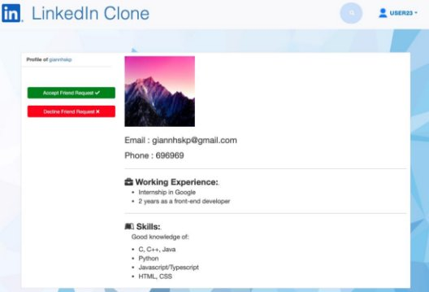

O user23 αποδέχεται το αίτημα σύνδεσης του giannhskp.

Πλέον ο giannhskp μπορεί να δει τα προσωπικά στοιχεία του user23 τα οποία ήταν ιδιωτικά και προηγουμένως δεν φαινόντουσαν, μπορεί να του στείλει μήνυμα και μπορεί να δει το δίκτυο συνδεδεμένων χρηστών του.

Προφανώς τα ίδια ισχύουν και αντίστροφα.

Πλέον η εικόνα που βλέπει ο giannhskp προβάλλοντας το προφίλ του user23 είναι η εξής:

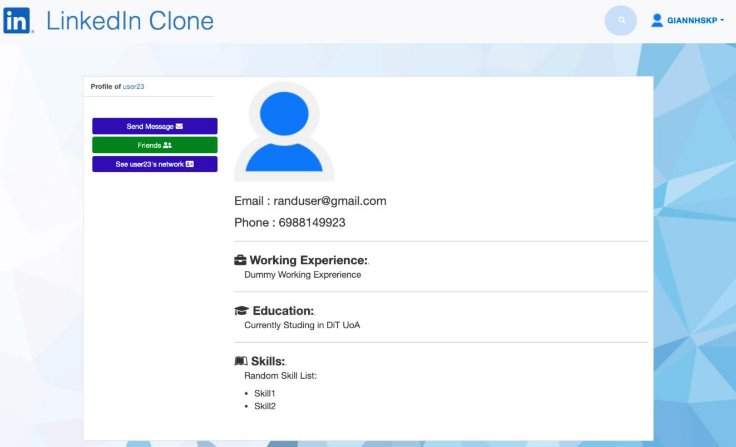

### Προβολή Αιτημάτων Σύνδεσης

Η εικόνα που έχει ο χρήστης στην καρτέλα Friend Requests είναι η εξής:


### Δίκτυο - Network

Ακολουθεί εικόνα από το δίκτυο του χρήστη giannhskp ο οποίος είναι συνδεδεμένος με δύο χρήστες, τους: user2 και user23.

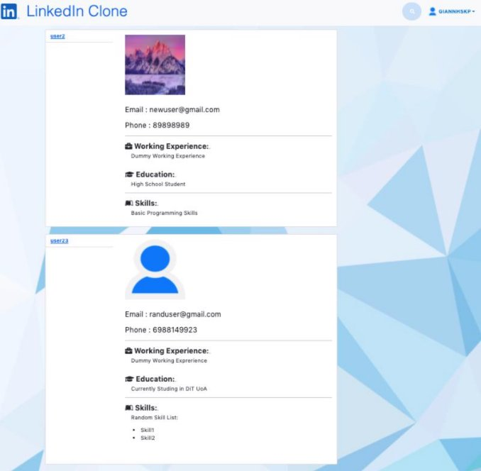

### Αγγελίες - Job Posts


Μέσω ενός κουμπιού στο δεξί μέρος της οθόνης ο χρήστης μπορεί να επιλέξει εάν θέλει να βλέπει μόνο τις δικές του αγγελίες (έτσι ώστε να ελέγξει τις αιτήσεις) ή αν θέλει να βλέπει όλες τις αγγελίες.


Η εικόνα που βλέπει ένας χρήστης στην καρτέλα Job Posts είναι η εξής:

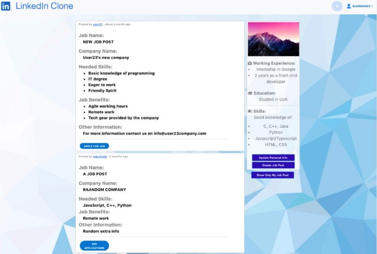

### Προσωπικές Αγγελίες

Πιο συγκεκριμένα, η καρτέλα προβολής της αγγελίας είναι η εξής:


Πατώντας το κουμπί “SHOW JOB APPLICATIONS” μπορεί να δει όλες τις αιτήσεις. Οι αιτήσεις φαίνονται ως εξής:

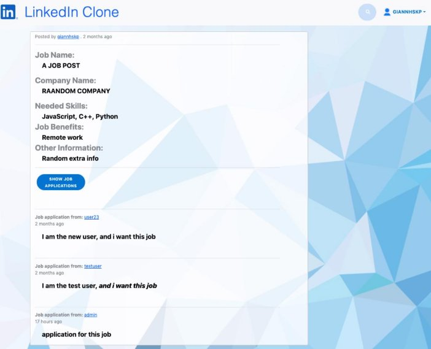

### Αγγελίες Άλλων Χρηστών

H καρτέλα προβολής της αγγελίας είναι η εξής:

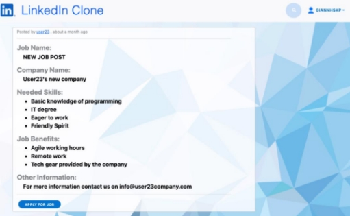

Πατώντας το κουμπί "APPLY FOR JOB", εμφανίζεται ένα πλαίσιο κειμένου μέσω του οποίου ο χρήστης μπορεί να γράψει το επιθυμητό κείμενο για την αίτηση του.

Στην συνέχεια πατώντας το κουμπί "APPLY" μπορεί να αποστείλει την αίτηση του, ενώ πατώντας το κουμπί “DISCARD” μπορεί να ακυρώσει την αίτηση και να αποκρύψει το πλαίσιο κειμένου.

Η φόρμα της αίτησης φαίνεται ως εξής:


### Μηνύματα


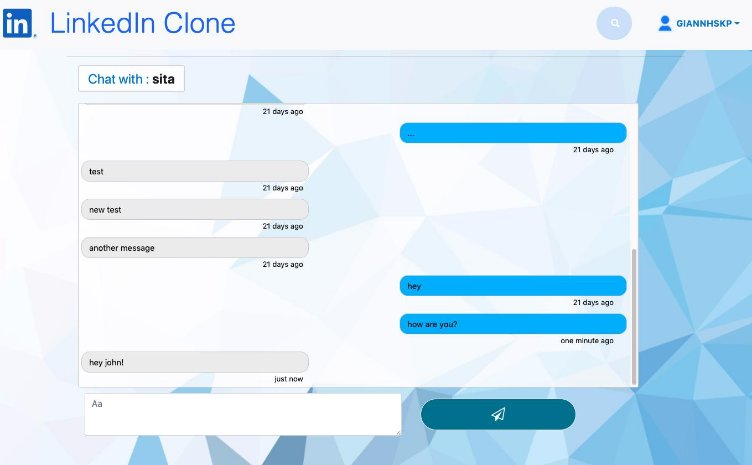

### Συζητήσεις

Μια ενδεικτική εικόνα από την καρτέλα “Messages” είναι η εξής:

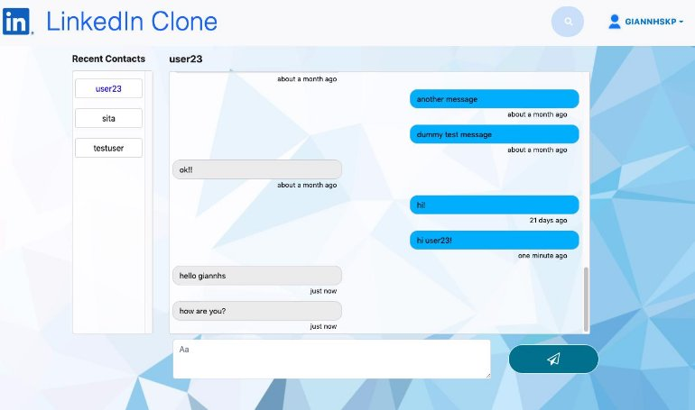

### Ειδοποιήσεις


Τα κουμπιά φαίνονται ως εξής:


Μια ενδεικτική εικόνα από την καρτέλα ειδοποιήσεων είναι η εξής:

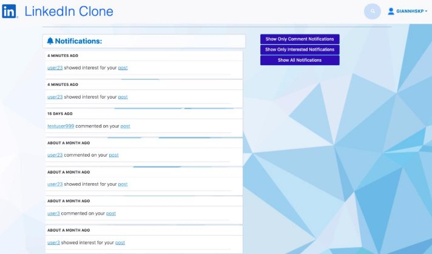

Για τις ειδοποιήσεις οι οποίες αφορούν αιτήματα σύνδεσης έχει δημιουργηθεί ξεχωριστή καρτέλα η οποία περιγράφεται στην παράγραφο [Προβολή Αιτημάτων Σύνδεσης](#_page11_x56.69_y41.37).

### Προσωπικά Στοιχεία


Τα κουμπιά έχουν την εξής μορφή ανάλογα με το αν ο χρήστης έχει επιλέξει να είναι δημόσια ή ιδιωτική μια πληροφορία:


Αν ο χρήστης θέλει να αλλάξει την επιλογή δημόσια/ιδιωτική, κάνει κλίκ στο αντίστοιχο κουμπί, εμφανίζεται το drop-down menu και επιλέγει την “αντίθετη” επιλογή. Η αλλαγή αποθηκεύεται αυτόματα και πλέον στο κουμπί εμφανίζεται η νέα επιλογή απορρήτου.


Η εικόνα που βλέπει ο χρήστης στην καρτέλα Personal Info είναι η εξής:


### Ρυθμίσεις

Η εικόνα που βλέπει ο χρήστης στην καρτέλα Settings είναι η εξής:

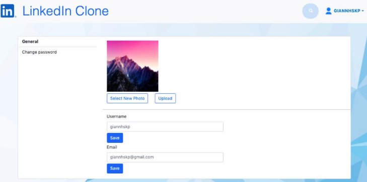


### Διαχειριστής Εφαρμογής

Ο ρόλος του διαχειριστή έχει οριστεί σε έναν χρήστη κατα την εγκατάσταση της εφαρμογής.

Ο διαχειριστής, κατά την σύνδεση του ανακατευθύνεται σε μία σελίδα (αντίστοιχη με αυτή του [Δίκτυο - Network]) στην οποία εμφανίζονται σε μορφή λίστας όλοι οι εγγεγραμμένοι χρήστες της εφαρμογής.

Σε αυτήν την σελίδα μπορεί να μεταφερθεί και επιλέγοντας την καρτέλα User List από το drop-down menu (ή πατώντας το logo στο header της εφαρμογής) όπου στην περίπτωση του διαχειριστή εμφανίζει όλους τους χρήστες της εφαρμογής και όχι μόνο τους συνδεδεμένους με αυτόν χρήστες (όπως θα γινόταν για έναν κανονικό χρήστη).

Επιλέγοντας έναν χρήστη (και κάνοντας κλικ στο όνομα του), ο διαχειριστής ανακατευθύνεται στην σελίδα προβολής του προφίλ του χρήστη αυτού.

Από την σελίδα αυτή ο διαχειριστής μπορεί να δει όλες τις πληροφορίες σχετικά με τον χρήστη αυτόν. Πιο συγκεκριμένα βλέπει πληροφορίες όπως:

- Τα προσωπικά του στοιχεία (π.χ. email, τηλέφωνο)
- Την επαγγελματική του εμπειρία, τις πληροφορίες σχετικά με την εκπαίδευσή του και τις δεξιότητές του.
- Τα άρθρα και τις αγγελίες που έχει αναρτήσει.
- Τα σχόλια που έχει προσθέσει σε άρθρα.
- To δίκτυο του χρήστη.

Τέλος, μέσω των κουμπιών που εμφανίζονται στο αριστερό μέρος της οθόνης κατα την προβολή του προφίλ ενός χρήστη, ο διαχειριστής μπορεί να εξάγει όλες αυτές τις πληροφορίες σχετικά με αυτόν τον χρήστη τόσο σε μορφή XML όσο και σε JSON.

### Αποσύνδεση

Κάνοντας κλικ στην επιλογή "Logout" του drop-down menu, o χρήστης μπορεί να αποσυνδεθεί από την εφαρμογή.

Όταν ένας χρήστης αποσυνδέεται, διαγράφεται JSON Web Token το οποίο είχε λάβει κατά την σύνδεση του στην εφαρμογή. Έτσι, το JWT δεν μπορεί πλέον να χρησιμοποιηθεί για αιτήσεις στην εφαρμογή και κάθε αίτηση με αυτό το JWT απορρίπτεται.

Όταν ο χρήστης συνδεθεί ξανά στην εφαρμογή, τότε θα λάβει ένα νέο JWT μέσω του οποίοι θα πραγματοποιεί τις αιτήσεις στην εφαρμογή.

Έπειτα από την αποσύνδεση του χρήστη, ανακατευθύνεται στην Welcome Page.
